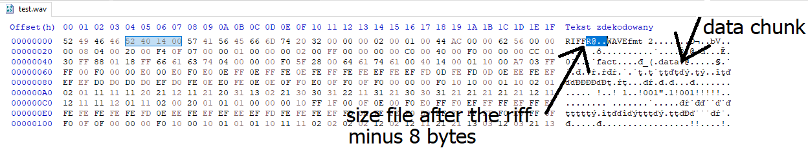

# Function repairs ADPCM audio file which was encoded with disrupted frame

Function repairs ADPCM audio files. ADPCM (Adaptive Differential Pulse-Code Modulation) is audio loss compression algorithm. Audio signal is saved in wav files
file with header like WAV PCM but there is a huge difference between them. In ADPCM wav file format signal during
encoding is framed. Decoding bases on information from header for example chunk size - the 4 bytes pole located after the RIFF description.
If during encoding any frame of signal is disrupted, then proper decoding is imposible.
Framed disrupted audio signal due to shift of frame, gives "robot voice" or completly unintelligible sound.

This function works by removing one byte of data chunk in every iteration, and after this generate the same file
with right chunks size. Default number of iteratrions is 10 but usualy there should be more then 400. After file
creation user have to play the file and evaluate the signal quality.

